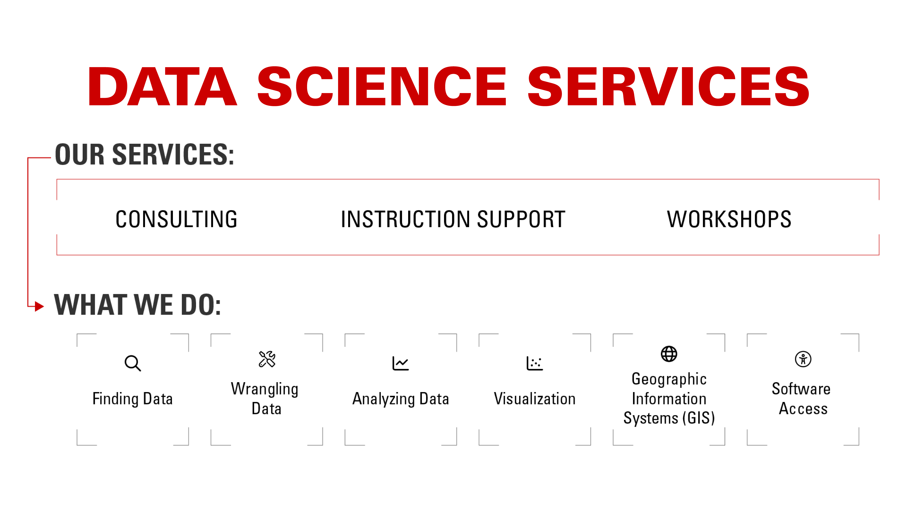
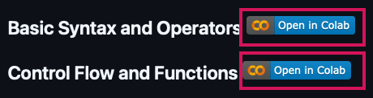
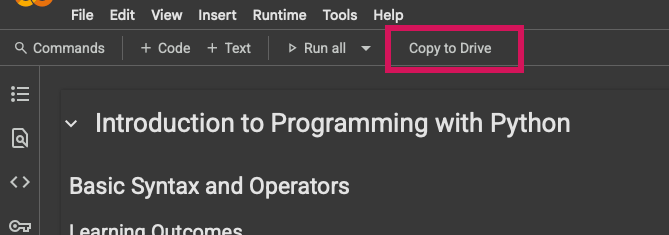
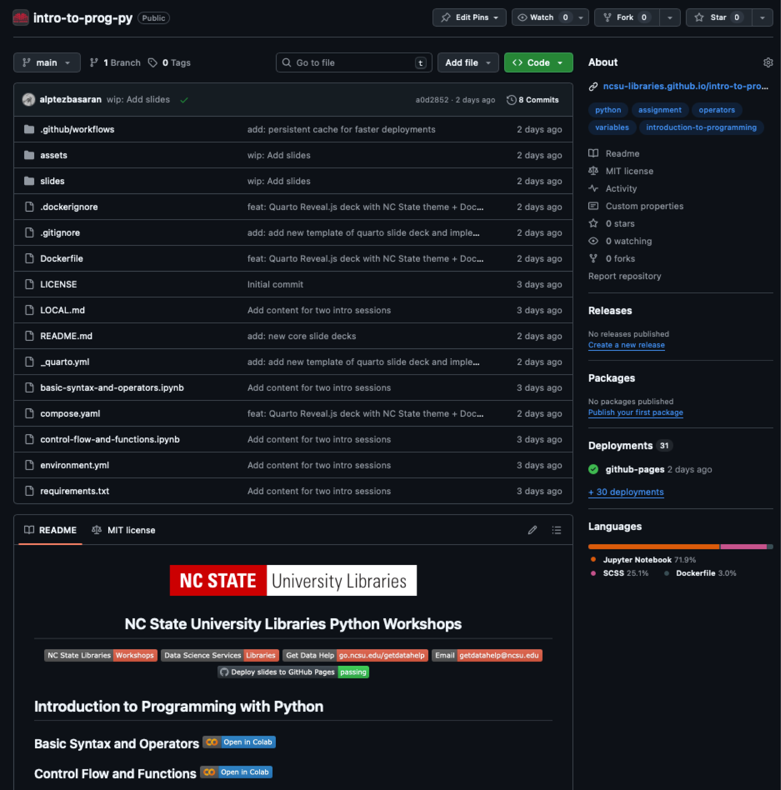

## Welcome

Slides: <a href="https://go.ncsu.edu/dss-python" target="_blank"><strong>https://go.ncsu.edu/dss-python</strong></a>

 

To get a `complete` from this session:

- In-person: Sign the attendance sheet
- Virtual: We will use Zoom attendance

---

---

## Who we are {.team-slide}

::::::: {.team-grid}
::::::: {.person}

<strong>Mara Blake</strong>

Head, Data Science Services

:::::::

::::::: {.person}

<strong>Shannon Ricci</strong>

Associate Head, Data Science Services

:::::::

::::::: {.person}

<strong>Jeff Essic</strong>

Lead Librarian for GIS

:::::::

::::::: {.person}

<strong>Alp Tezbasaran</strong>

Data Science Librarian

:::::::

::::::: {.person}

<strong>Selene Schmittling</strong>

Data Science Librarian

:::::::

::::::: {.person}

<strong>Lynnee Argabright</strong>

Data Science Teaching Librarian

:::::::
:::::::

:::::: {.team-summary}
Our team comes from a variety of academic backgrounds, including nuclear engineering, electrical engineering, marine ecology, history, information science, natural resources, and geographic information sciences.
::::::

---

## Check our workshops

  <a href="https://go.ncsu.edu/datavizworkshops" style="color: #CC0000; text-decoration: underline;">go.ncsu.edu/datavizworkshops</a>
 

:::::: {.nonincremental style="font-size: 1.6rem; line-height: 1.2;"}
- Mapping and Analyzing Urban Heat Island Effects with ArcGIS Online
- Designing Data Visualizations for Research Presentations and Publications
- Getting Started with Python [R]: Fundamentals
- Getting Started with Python [R]: Loops and Functions
- Exploratory Data Analysis with Python [R]
- Git Moving: A Beginner's Guide to Version Control
- Colab and Chill: A Vibe Coding Approach to Exploratory Data Analysis using AI
::::::

Have workshop ideas? Contact us!

---

### How to contact us

  <a href="https://go.ncsu.edu/getdatahelp" style="color: #CC0000; text-decoration: underline;">go.ncsu.edu/getdatahelp</a>

Direct email: <a href="mailto:getdatahelp@ncsu.edu">getdatahelp@ncsu.edu</a>

---

## Who is this workshop for?

<ul>
  <li>Learners who know basic Python syntax (variables, lists, simple conditionals/loops)</li>
  <li>Anyone who wants to build confidence exploring tabular data in a repeatable way</li>
  <li>People who use spreadsheets and want a Python workflow for analysis</li>
</ul>

<ul>
  <li>Best fit in the full <b>Getting Started with Python</b> sequence:
    <ul>
        <li>Getting Started with Python - Fundamentals</li>
        <li>Getting Started with Python - Loops and Functions</li>
        <li><code>Exploratory Data Analysis with Python</code></li>
    </ul>
  </li>
</ul>

---

## What is exploratory data analysis?

- Goal: understand quality, structure, and patterns before modeling
- Typical cycle: inspect -> clean -> visualize -> summarize -> refine
- Outcome: better questions and better next analysis steps

---

## EDA Concepts

- **Shape**: rows and columns
- **Schema**: column data types
- **Missingness**: null counts and percentages
- **Distribution**: center, spread, skew, outliers
- **Cardinality**: number of unique values
- **Grain**: what one row represents
- **Association**: variables that move together (not causation)

---

## What can EDA help us decide?

- Are we ready to analyze, or do we need more cleaning?
- Which variables look useful, redundant, or suspicious?
- Which transformations/features should we try next?
- Which subgroups need deeper analysis?
- What should come next: statistical test, model, or new data collection?

### Important boundary
- EDA helps generate evidence and hypotheses, but it does **not** prove causation.

---

## Why Polars in this workshop?

- Fast and memory-efficient for tabular workflows
- Expression-based API keeps transformations readable and teachable
- Great for core data-frame verbs (`select`, `filter`, `with_columns`, `group_by`)
- Works well with familiar plotting tools like `matplotlib`

---

## Polars vs pandas (quick view)

| Topic | Polars | pandas |
|---|---|---|
| Execution style | Expression-oriented, optional lazy mode | Eager by default |
| Performance | Often faster on larger tabular transforms | Strong general-purpose baseline |
| Teaching focus today | Clear pipeline thinking | Familiar ecosystem many already know |
| Recommendation | Use whichever fits your workflow/team | Concepts transfer between both |

---

# Follow the instructor on Google Colab

::::::: {.columns}
:::::: {.column width="50%" style="font-size: 1.4rem; line-height: 1.2;"}
**During the workshop:**

- Open your Colab notebook
- Type along with the instructor
- Run each code cell after we write it
- Ask questions if something doesn't work
::::::

:::::: {.column width="50%" style="font-size: 1.4rem; line-height: 1.2;"}
**Tips for following along:**

- Keep your notebook visible
- Don't worry about typos - we'll catch them
- Experiment with changing values
- Save your work frequently
::::::
::::::: 

---

### How to access workshop material?

::::::::: {.columns}
:::::: {.column width="50%" style="font-size: 1.7rem; line-height: 1.1;"}
1. Go to   <a href="https://go.ncsu.edu/dss-python" target="_blank">https://go.ncsu.edu/dss-python</a>
2. Scroll down to the right session. Click "Open in Colab"  

3. Click "Copy to Drive"  

::::::

:::::: {.column width="50%"}

::::::
:::::::::

---

### How to contact us

  <a href="https://go.ncsu.edu/getdatahelp" style="color: #CC0000; text-decoration: underline;">go.ncsu.edu/getdatahelp</a>

Direct email: <a href="mailto:getdatahelp@ncsu.edu">getdatahelp@ncsu.edu</a>

---

## Continue learning Python!

- NC State University Libraries workshops 
- LinkedIn Learning: lots of python courses!
- [Python for Data Analysis 3e](https://wesmckinney.com/book/)
- Search documentation for packages you want to learn!
- Ask AI! (but learn the basics and concepts first)

--- 

### Tell us how we did
[go.ncsu.edu/dss-workshop-eval](https://go.ncsu.edu/dss-workshop-eval)
<!-- qr_eval -->

  

THANK YOU

::::::: {.hidden}

:::::::
